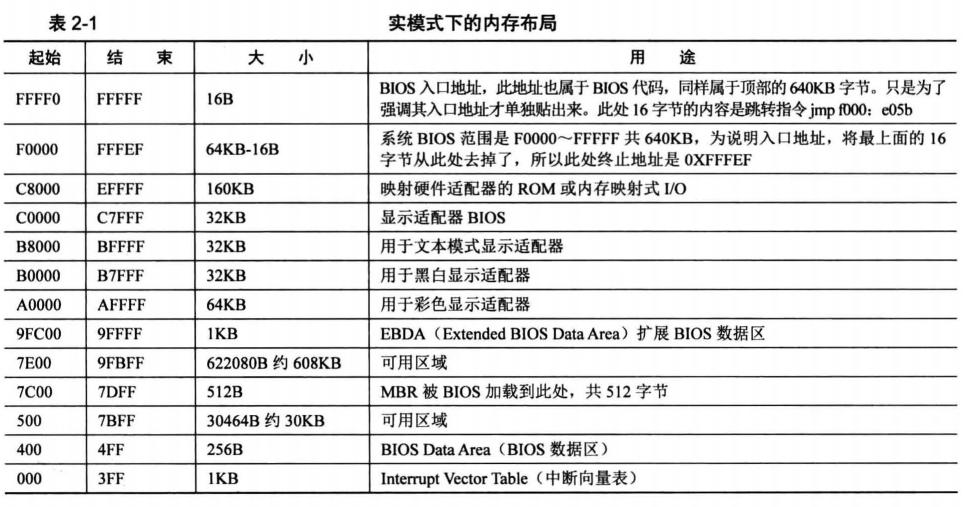

BIOS启动
-------------

BIOS可以使用大约1MB内存(地址空间为0x0 ~ 0xF_FFFF), 其中低640KB(0x0 ~ 0xA_0000)对应了实际的物理内存, 之后的内存空间映射了各类硬件, 内存布局如下表所示:

计算机启动后会设置段寄存器cs和指令寄存器ip的值分别为0xF000和0xFFF0, 基于分段访问机制, cs寄存器左移4位后与ip寄存器相加得到0xF_FFF0. 该位置实际是就是BIOS可用内存空间的最高处. 此处的16字节对应一个JMP指令, 跳转到BIOS的实际起始代码的位置.
 
BIOS的代码会进行硬件的状态检查, 建立中断向量表等工作.  在确认硬件的各项检查均正常后, BIOS的最后一项工作是

加载MBR
-------------

BIO在确认硬件的各项检查均正常后, 最后一项工作是加载MBR(Main Boot Record)数据.  MBR是一段代码, 其长度为512字节, BIOS的代码固定从硬盘的0盘0道1扇区（即硬盘的第一个扇区）加载MBR记录.

BIOS将其加载到内存0x7c00的位置, 之后由MRB中的代码负责引导操作系统内核. 

> 从内存布局可以看到, 0x7C00是低32KB的空间中最后1KB的空间, 这样设置能够尽可能避免MBR太早被内核数据覆盖导致错误

本项目的MBR位于文件[boot/mbr.S](../boot/mbr.S), 其中主要执行了两件事情

1. 清空屏幕后输出几个字符到屏幕, 表明MBR加载成功
   1. 汇编基础知识可参考[汇编语言笔记](https://lizec.top/2017/12/05/%E6%B1%87%E7%BC%96%E8%AF%AD%E8%A8%80%E7%AC%94%E8%AE%B0/)
   2. 关于显存的基本操作可参考[汇编语言笔记-显存操作](https://lizec.top/2017/12/05/%E6%B1%87%E7%BC%96%E8%AF%AD%E8%A8%80%E7%AC%94%E8%AE%B0/#%E6%98%BE%E5%AD%98%E6%93%8D%E4%BD%9C)
2. 从硬盘加载内核加载器
   1. 关于如何从硬盘加载数据, 可参考[0x11从硬盘加载数据](https://www.kn0sky.com/?p=42#%E7%A1%AC%E7%9B%98%E7%AE%80%E4%BB%8B)

由于BIOS仅加载512字节数据, 无法在MBR中完成内核的加载操作. 因此MBR代码的主要工作是将内核加载器加载到内存之中, 并由加载器将系统内核加载到内存. 内核加载器可以放置在(0x500 ~ 0x7C00)的任何位置, 本系统将其放置在0x900处.

内核加载器
--------------

本项目的内核加载器位于[boot/loader.S](../boot/loader.S), 内核加载器需要完成如下四件事情:

1. [检查可用内存](https://www.kn0sky.com/?p=44#%E5%AE%9E%E7%8E%B0%E8%8E%B7%E5%8F%96%E7%89%A9%E7%90%86%E5%86%85%E5%AD%98%E5%AE%B9%E9%87%8F)
2. 进入[保护模式](0x12保护模式.md)
3. [从硬盘加载内核代码]((https://www.kn0sky.com/?p=42#%E7%A1%AC%E7%9B%98%E7%AE%80%E4%BB%8B))
4. [启用分页](0x14内存分页.md) 

每项任务的详细内容可查看对应的文档. 经过上述操作后, 内核加载器将控制器移交给内核代码, 同时从此刻开始, 也可以使用C语言进行开发, 而不用再全程使用汇编语言了.