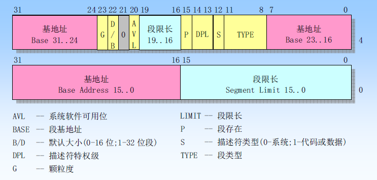

保护模式
-----------

保护模式是一种CPU的执行模式, 在保护模式之前的CPU运行模式称为实模式. 在实模式下, 所有代码都具有同样的权限, 可以随意的访问任何的内存位置, 进行任何的操作. 因此容易出现一个程序的故障导致整个系统不可用的问题.

全局描述符
---------------

在保护模式下, 代码不再能随意访问内存. 为了实现这一功能, CPU引入了全局描述符表(Global Descriptor Table, GDT). GDT记录了不同的段的基本属性, 从而能够对段的访问行为进行控制. 当不符合要求的行为出现时, CPU能够自动检测并抛出异常.

段描述符
-----------------

GDT在内存中实际就是一个数组, 其中的每个元素都是一个端描述符, 段描述符占8个字节, 其结构如下所示

其中8字节可以分为低位4字节和高位4字节. 

### 基地址和段限长

基地址就是这个段实际的物理地址位置. 为了提高转换效率, CPU完成拼接操作后, 会将基地址缓存到寄存器中,后续再使用时能够直接从缓存获取.

>  由于历史兼容性问题, 基地址被分成了三个部分. 

段限长是这个端的最大长度, 一共有20位. 根据其基本单位的长度, 可以表示1MB长度(单位为1字节)或者4GB长度(单位为4KB). 基本长度单位由G位指示. G为取值为1时表示基本长度为4KB, 否则基本长度为1字节.

### S字段和字段类型

S字段取值为1是表示该段为系统段, 取值为0时表示该段为数据段. 不同S取值时, TYPE段具有不同的含义. 当S指示为数据段时, TYPE段可以分为四个属性, 具体情况如下表

内存段类型  | X | R | C | A | 说明
-----------|---|---|---|---|--------------
代码段      | 1 | 0 | 0 | * | 只可执行代码
代码段      | 1 | 1 | 0 | * | 可读可执行代码
代码段      | 1 | 0 | 1 | * | 可执行一致性代码
代码段      | 1 | 0 | 0 | * | 可读可执行一致性代码
内存段类型  | X | W | E | A | 说明
数据段      | 0 | 0 | 0 | * | 只读数据
数据段      | 0 | 1 | 0 | * | 可读可写数据
数据段      | 0 | 0 | 1 | * | 只读向下扩展数据
数据段      | 0 | 1 | 1 | * | 可读可写向下扩展数据

- 段默认向上扩展, 但栈需要向下扩展, 因此栈对应的段需要将E位设置为1.
- A表示Access, CPU访问改段后会自动将其置位1
- 

### DPL字段

DPL字段表示该段的特权等级, 该字段有2bit, 因此可以表示四种特权等级. 数字越小, 特权等级越高, 一般操作系统使用0特权等级, 用户代码使用3特权等级.

> 设置不同的特权等级, 即可将操作系统代码和用户代码区分开

### P字段

P字段表示段是否存在于内存之中, 如果为0则CPU访问时抛出相应的异常, 操作系统需要补货该异常并进行适当的处理.

> 开启分页模式后, 基本上就不会按照字段换出内存了

### D/B字段和L字段

D/B字段指示操作数大小, 取值为1时表示以32位模式运行, 取值为0时表示以16位模式运行.

L指示代码段类型, 取值为1表示64位代码模式运行, 取值为0表示以32位代码模式运行.

### AVL字段

该字段保留

全局描述符
--------------------

GDT记录了所有的段信息, 这些信息也存储在内存之中, 因此CPU需要知道GDT在内存中的位置. 对此, CPU提供了一个专门的寄存器GDTR. 

该寄存器长度为6字节, 其中低位的2字节存储段限长, 高位的4字节存储GDT内存的起始地址. 

> 限长字段16bit可以表示65535字节, 每个段描述符占8字节, 因此最多可以存储8192个段

选择子
--------------

在实模式下, 段寄存器表示的是段开始的位置, 在保护模式下, 这些寄存器不再表示地址, 而是表示选择子. 

选择子的0~1位表示特权等级, 第2位是TI位表示数据是存储在GDT中还是LDT中. 剩余的13位表示数据在GDT中的索引.

> 13bit最多可以表示8192个数据, 正好和GDT最大段数量吻合

进入保护模式
---------------

进入保护模式需要完成三件事情

1. 建立GDT表
2. 打开A20地址线
3. 打开保护模式开关

完成上述三个操作后, CPU就会从实模式切换到保护模式. 由于CPU内部使用了流水线, 因此切换到保护模式后还需要使用跳转指令修改CS的值, 使得CPU清空流水线中已经译码的指令.
