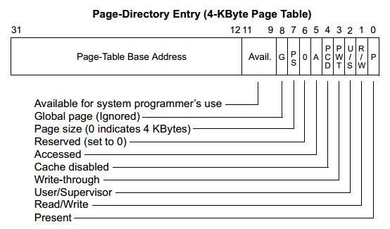
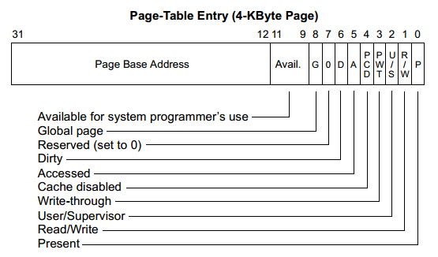

分页的目的
---------------

启用分页机制后, 各个程序以内存页为基本单位, 可以减少内存碎片, 更加充分的利用物理内存空间. 虚拟地址的引入使得逻辑上连续的内存空间在物理上可以不连续. 内存页的换入与换出机制使得不使用的内存页可以存放在硬盘之中, 进一步提高了程序的可利用内存.


页表设计思路
------------------

页表的核心思路是将内存按照页大小进行划分, 程序在使用内存空间时, 也将页作为最小的内存分配单位. 

在操作系统中, 通常将页大小设置为4KB, 即对应12bit的地址空间. 此时对应任何一个地址, 都可以将其分割为20bit的页表索引和12bit的页表内偏移. 此时页表的工作就是将20bit的虚拟地址转换为20bit的物理地址.

需要注意的是, 在启用内存分页以后, 页表本身也需要按照页大小存储, 因此每页最多为4KB. 如果表中的一项占32bit, 则一页最多存储 4K / 4 = 1K 项. 如果仅采取单级页表, 则最多可表示 1K * 4K = 4M的空间. 这对于现代操作系统而言显然是不够的.

为了扩展页表的表示范围, 引入二级页表就变得非常直接了. 相当于将上述的页表作为页表的页表. 其中的每一项不再指向具体的物理页, 而是指向一个二级的页表. 基于此结构, 相当于拥有了1K个页表, 而每个页表又具有1K个项, 从而获得1K * 1K * 4K = 4G的空间.


页表结构与查询过程
-------------------

根据分页机制的实现原理, 二级页表将一个32bit的地址分割为三个部分, 其中最高位的10bit对应了页目录项(Page Directory Entry, PDE)的索引值, 中间的10bit对应了页表项(Page Table Entry, PTE)的索引值, 最低的12bit对应相应的内存页中的偏移值.

给定一个虚拟地址, 将其转换为物理地址时需要经过多个步骤的转换. 首先取虚拟地址的最高10bit. 根据页表的起始位置可定位到对应的PDE项. 其中PDE项的结构如图所示



其中高20bit记录了该虚拟地址对应的PTE的基址地址. 由于PTE每一项均占据4KB空间, 因此在内存对齐的情况下, 每一个PTE的起始位置低12bit都为0, 因此在PDE中无需记录这低12bit的信息.

------------------------

根据PDE中的基址信息, 可以找到对应虚拟地址的PTE基址, 将其与虚拟地址的中间10bit相加, 即可得到对应的PTE项, 其中PTE项的结构如图所示



PTE项的结构与PDE项基本相同, 仅部分属性的含义不同. 同样地, 其中高20bit记录了该虚拟地址对应的物理地址的高20bit, 在结合虚拟内存的低12bit, 即可将虚拟的32bit地址转换为真实的32bit地址.


页表在内存中的结构
-----------------

在LOS项目中, 页表的构建过程如下所示:

```s
; ---------------------------------------------
; 过程：创建页目录和页表
setup_page:
; ---------------------------------------------
; 清空页目录所在内存空间
  mov ecx, 4096
  mov esi, 0
.clear_page_dir:
  mov byte [PAGE_DIR_TABLE_POS + esi], 0
  inc esi
  loop .clear_page_dir
; 创建页目录
; 页目录对应地址中的10bit, 因此需要0x400项, 其中 0x0~0x2ff 项分配给用户, 0x300~0x3ff 项分配给内核
; 整个虚拟地址对应4GB空间, 因此用户使用低3GB空间, 内核使用高1GB空间
; 页目录每一项占据4字节, 页目录表正好使用0x400 * 4 = 0x1000(4K)字节的空间
.create_pde:
  mov eax, PAGE_DIR_TABLE_POS

  add eax, 0x1000   ; 移动到页目录表末尾
  mov ebx, eax      ; eax和ebx现在指向页目录后的空闲空间, 即第一个页表项的起始位置
  
  or eax, PG_US_U | PG_RW_W | PG_P          ; 给eax附加页面的属性
  ; 将用户空间的第一项和内核空间的第一项指向同一个页表, 稍后设置该页表的内容
  mov [PAGE_DIR_TABLE_POS + 4*0x000], eax  
  mov [PAGE_DIR_TABLE_POS + 4*0x300], eax

  ; 页目录最后一项规定指向自己
  sub eax, 0x1000             ; eax重新指向页目录的真实物理位置
  mov [PAGE_DIR_TABLE_POS + 4*0x3ff], eax

; 创建页表项, 一个页表也对应10bit地址, 因此也有0x400项, 每一项需要4字节, 整个页表同样占据0x1000字节空间
; 首先映射真实物理内存中低区1M空间
  mov ecx, 0x100 ; 每一页大小为4KB, 因此1M空间需要分配 1M(0x10_0000) / 4K(0x1000) = 0x100 项
  mov esi, 0     ; 页表项索引
  mov edx, PG_US_U | PG_RW_W | PG_P ; 真实物理地址从0开始
.create_pte:
  mov [ebx+esi*4], edx              ; ebx在上一步指向了页目录的末尾, 也即页表的起始位置
  add edx, 0x1000                   ; 实际的物理地址值, 每次增加4K
  inc esi
  loop .create_pte

; 给内核的虚拟地址分配页表空间
; 内核占据高1GB的空间, 为了便于后续的共享, 对这些空间提前分配页表
  mov eax, PAGE_DIR_TABLE_POS
  add eax, 0x2000                     ; 页目录占据0x1000字节, 低位的1M空间的页表占据0x1000字节, 此后是可用空间
  or eax, PG_US_U | PG_RW_W | PG_P
  mov ebx, PAGE_DIR_TABLE_POS
  mov ecx, 0x100 - 2  ; 虚拟地址的第一页和最后一页已经做了特殊处理, 所以跳过
  mov esi, 0x301      ; 从第301项开始映射, 直到最后一项之前
.create_kernel_pde:
  mov [ebx+esi*4], eax
  inc esi 
  add eax, 0x1000     ; 每个页表需要0x1000字节的空间 
  loop .create_kernel_pde
  ret
```

经过上述操作后, 内存中相当于具有如下的布局:

- 起始位置的第1个4KB空间为页目录项
  - 第0x0项 和 第0x300项 已经初始化, 指向了后续的页表
  - 第0x301项 ~ 0x399项 进行了初始化, 指向了对应的内存位置, 但对应位置并未初始化页表
- 起始位置的第2个4KB空间为页表项
  - 第0x0项 ~ 0x100项 已初始化, 指向了物理地址从0开始的1M空间
  - 剩余 0x300项 并未初始化
- 起始位置的第3个4KB空间开始, 共计0x100-2=0xfe个4KB空间已经在页目录项中划分为页表空间, 但尚未初始化

使用`info tab`指令可查看虚拟地址和物理地址的对应关系, 当前输出如下

```
<bochs:39> info tab
cr3: 0x000000100000
0x00000000-0x000fffff -> 0x000000000000-0x0000000fffff
0xc0000000-0xc00fffff -> 0x000000000000-0x0000000fffff
0xffc00000-0xffc00fff -> 0x000000101000-0x000000101fff
0xfff00000-0xffffefff -> 0x000000101000-0x0000001fffff
0xfffff000-0xffffffff -> 0x000000100000-0x000000100fff
```

从上面的映射关系可以看到: 虚拟内存的最低1M空间, 和从0xc0000000开始的1M空间均映射到物理内存的最低1M空间, 这符合预期.

对于剩下的三个映射, 首先可以注意到 0xffc00fff 的二进制表示为

```
1111 1111 1100 0000 0000 1111 1111 1111
```

因此该地址的最高10bit正好全部是1, 对应页目录表最后一项, 该项指向页目录表本身. 因此接下来会将页目录表当做页表使用. 中间10bit正好全部是0, 因此正好可以对应页目录表第0项. 而第0项中的高20bit是第一个页表的地址, 因此0xffc00000-0xffc00fff实际就映射了第一个页表, 对这段虚拟地址进行修改就可以直接修改页表. 这也是页目录表最后一项需要指向自己的原因.


快表(TLB)
---------------

由于分页的转换过程需要多次查询内存, 一个地址转换过程需要如下的步骤

1. 根据CR3寄存器获得页目录表在内存中的位置
2. 根据虚拟地址的高10bit计算页目录项在页目录表中的偏移
3. 从页目录表中得到页表的物理地址
4. 根据根据虚拟地址的中间10bit在页表中定位页表项的偏移
5. 从页表项中得到真实物理地址的高20bit
6. 将物理地址的高20bit与虚拟地址的最低12bit拼接, 得到真实物理地址

由于内存的速度显著低于CPU的速度, 因此如果每次内存访问都有增加这么多转换步骤, 那么开启分页模式后, 系统的性能将会显著降低. 为了解决这一问题, CPU中引入了快表.

快表实际上可以认为是一个缓存, 其中记录了虚拟地址的高20bit与真实地址的高20bit的对应关系, 从而可以直接通过一次快表查询获得对应的地址.


CPU添加快表记录和查询快表属于硬件操作, 操作系统无法干预这一过程. 但由于快表属于高速缓存, 因此其容量较小, 需要通过合适的方法淘汰不常使用的项目, 操作系统可以控制快表条目的删除过程.
