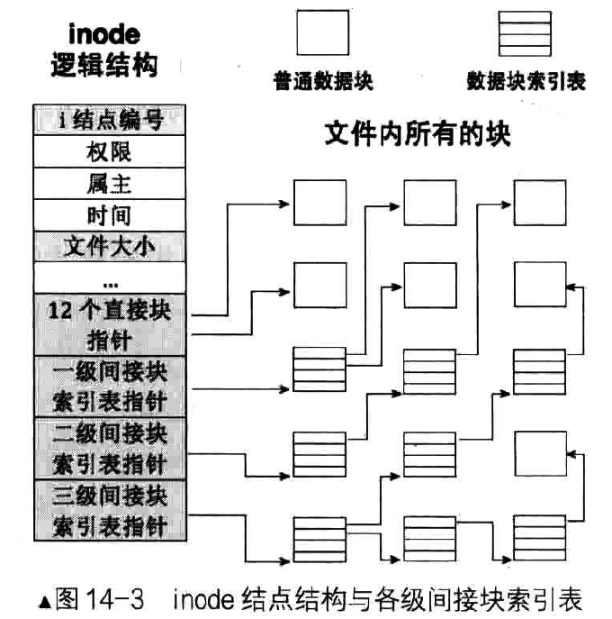
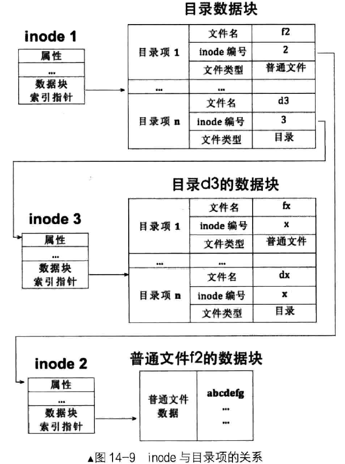

文件系统
===========


硬盘的基本概念
----------------

- 扇区: 硬盘读写的基本单位, 在磁道上均匀分布. 扇区从1开始编号, 每个扇区存储256xN字节数据, 通常N取值为2, 即扇区大小- 为512字节.
- 磁道: 盘片上的一个个同心圆, 磁道由外向里从0开始编号.
- 磁头: 一个硬盘通常有多个盘片, 每个盘片分正反两面, 两面都具有磁头. 磁头从上到下从0开始编号, 一般有2N个磁头
- 柱面: 磁盘读写数据时, 多个磁头同时写入到不同盘面相同编号的磁道上, 这些不同盘面的同一编号的磁道构成柱面.
- 分区: 多个编号连续的柱面组成分区. 一个柱面只能属于一个分区.

基于以上概念, 可以有如下的一些关系

1. 磁盘容量 = 单片容量 x 磁头数
2. 单片容量 = 每磁道扇区数 x 磁道数 x 512字节
3. 磁盘容量 = 每磁道扇区数 x 柱面数 x 512字节 x 磁头数

一般情况下, 每磁道扇区数都是63, 扇区大小都是512字节, 因此实际容量仅取决于柱面数与磁头数.


执行完`bximage`创建了一个80M的硬盘后, 输出了如下的数据

```
Creating hard disk image 'hd80M.img' with CHS=162/16/63 (sector size = 512)
```

即柱面数位162, 磁头数16, 每磁道扇区数62, 每扇区大小512, 因此可以计算磁盘容量为

```
162 x 16 x 63 x 512 = 83,607,552 = 79.73 M
```


硬盘分区
----------------

MBR一共占据512字节, 其中

- 0x0   ~ 0x1bd (446字节)为硬盘参数与引导指令
- 0x1be ~ 0x1fd (64字节) 为硬盘分区表
- 0x1fe ~ 0x1ff (2字节)  为结束标记 0x55 0xaa

由于MBR中分区记录表空间有限, 因此只能最初最多4个分区的信息. 

修改分区
-----------------

随便分一下就行, 书上的图片看不清, 可参考下面的文章

- [《操作系统真象还原》第13章 - Hell0er - 博客园](https://www.cnblogs.com/hell0er/articles/17238169.html)
- [linux下使用fdisk进行磁盘分区详解 - 人生的哲理 - 博客园](https://www.cnblogs.com/renshengdezheli/p/13941563.html)

在使用fdisk进行分区时发现, 起始扇区默认是2048, 是因为由于EFI的兴起，要给EFI 代码留磁盘最开始的1M空间.

- [为什么Linux的fdisk分区时第一块磁盘分区的First Sector是2048？](https://blog.csdn.net/Anonymous2017/article/details/71420218)


文件系统结构
--------------

在Unix系统中, 文件按照块进行存储. 一个文件按照块大小进行拆分, 存在在物理上可能并不相邻的块之中, 使用一个单独的索引表来记录文件涉及的块.



索引表采用多级结构, 其中前12个块可直接记录, 之后使用一级间接指针, 该指针指向一个索引表, 该索引表的每一项执行一个文件块的地址. 一个索引表可存储256个块地址. 如果还不够存储所有的块, 则还可以使用二级间接指针和三级间接指针. 最大情况下可存储

$$
12 + 256 + 256x256 + 256x256x256 = 16,843,020 
$$

如果每个块大小为4KB, 则可表示超过 64 GB 的大小.

-------------

Linux系统中每个分区可记录的inode数量是固定的, 一个inode对应一个文件, 因此每个分区可表示的文件数量也要是固定的. 使用`df -i`可查看分区inode利用率.


目录项与目录
---------------

在inode系统中, 并不包含文件的目录和文件名信息. 实际上, 在操作系统存储数据的层面上, 也并不关系这些信息. 因此目录和文件名需要单独的结构进行存储.

在Linux中, 目录也使用inode进行存储. inode模式下, 并不关心内部存储的是普通的文件内容, 还是目录内容. 




超级块与文件系统布局
---------------------

由于所有文件均使用inode格式存储, 因此还需要一个结构存储所有的inode信息, 这个块称为超级块. 超级块的大小是固定的.